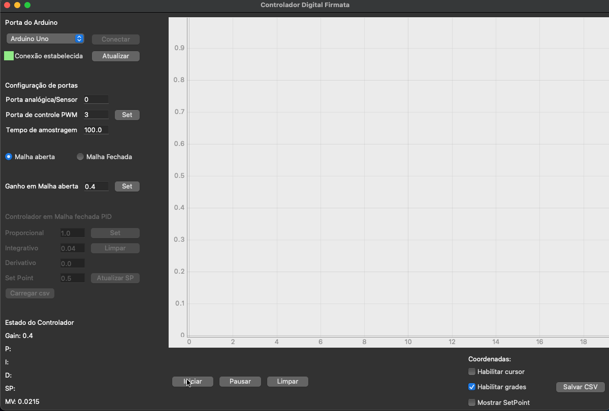

# Controlador Digital Firmata
 

# Overview

 Controlador digital Firmata é um software didático de controle utilizado em conjunto com uma placa Arduino. 
 
 O presente software foi desenvolvido com o intuito de ser utilizado em aulas práticas de controle, e para isto, com ele é possível realizar testes em malha aberta e malha fechada através de PID.



# Docs

Acesse a documentação através do [link](https://luizborgess.github.io/controlador-digital-firmata/).

# Installation

## Windows 

Baixe o arquivo executavel ou o arquivo zip através deste [link](https://github.com/luizborgess/controlador-digital-firmata/releases)

## MacOs

Para proceder com a instalação no MacOs, é necessário abrir o terminal, utilizar o comando:
```
cd <pasta_na_qual_deseja_instalar>

curl -JLO https://github.com/luizborgess/controlador-digital-firmata/archive/main.zip

unzip controlador-digital-firmata-main.zip

cd controlador-digital-firmata-main

chmod 755 install_mac.sh

./install_mac.sh
```

Para iniciar utilize o comando:

```
cd <pasta-do-programa>
python3 main.py
```


## Linux

Para executar o software no Linux, assume-se que o próprio Linux esteja atualizado com a versão de Python3 mais recente, possuindo isso, basta utilizar os comandos abaixo para baixar o software e instalar as dependências:

```
wget https://github.com/luizborgess/controlador-digital-firmata/archive/main.zip

unzip main.zip

cd controlador-digital-firmata-main

python3 -m pip install -r requirements.txt

sudo apt-get install --reinstall libxcb-xinerama0

python3 main.py
```

Para abrir o software insira os seguintes comandos no terminal:


```
cd <pasta-do-programa>

./main.py
```

# Dependencies

Python 3.9+
pyFirmata 1.1.0
numpy 1.20.3
pyqtgraph 0.12.1
PyQt5 5.15+
pyserial 3.5

# License

MIT license


