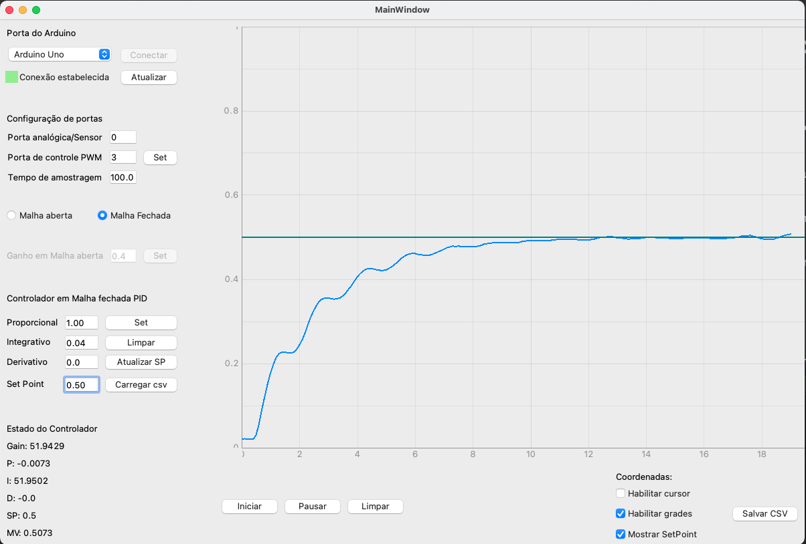

**Exemplo em Malha Fechada**
===============================================

**Exemplo em Malha Fechada e Controlador PID**

Ao conectar o Arduino prossegue-se para configuração das portas a serem utilizadas(Por predefinição portas A0-Entrada Analógica
e ~D3-Saida de PWM estão selecionadas)

Conferindo as configurações do software com a parte física prossegue-se para a configuração do controlador.

Seleciona-se Malha Fechada para configurar o controlador PID, bom possuindo os parâmetros desejados para o seguinte sistema:

O sistema a ser utilizado é o mesmo, que de outras imagens deste trabalho. Descrito pela função de transferência
abaixo:

.. math::
    G(s)=\frac{1.064s+21.28}{s^2+1.064s+21.28}

E para esse sistema oscilatório utilizou-se os seguintes parâmetros PID: P = 1.00, I = 0.04 e D = 0.00.

A sua resposta desejada a essa sintonia de PID é uma atenuação em suas oscilações quando comparado a resposta em
malha aberta.

Não se esqueça do Set Point!

Utilizaremos o setpoint de SP = 0.50, ou seja 50%.

Logo apos clica-se em Set para gravar os parâmetros PID e Setpoint desejado, em seguida para iniciar o processo
basta clicar em Iniciar, e o mesmo iniciar além da ação na planta física o desenho do gráfico com a resposta do sensor
conforme o tempo de amostragem definido na configuração da placa.

Ao decorrer do processo, pode-se alterar o Set point para verificar a resposta do sistema em relação a um novo Setpoint
para alterar basta modificar o valor na caixa de texto do set point e logo apos clicar em Atualizar SP.

Imagem contendo a configuração e a resposta do sistema:

