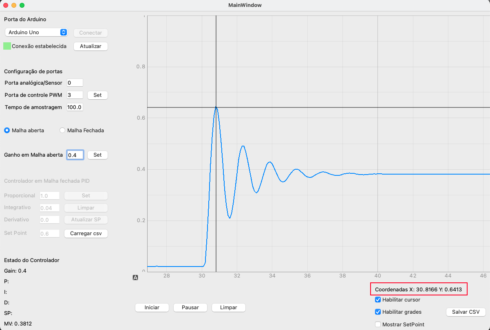
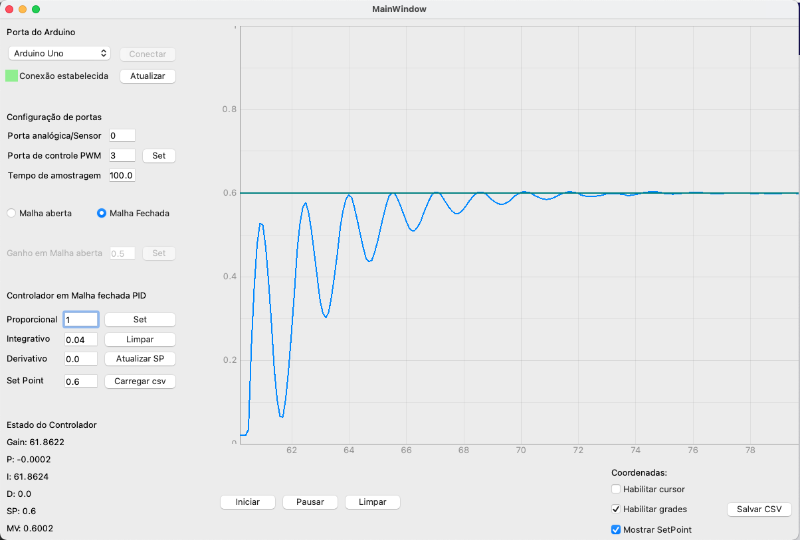

**Recursos Disponíveis**
===============================================

O gráfico
---------------

O widget de gráfico do software utiliza a biblioteca Pyqtgraph, essa biblioteca permite que salve o gráfico como imagem,
possibilita modificar a visão do gráfico em relação ao plot, permite também habilitar a grade do gráfico, pois bem, como
fazer isso?

#salvar como imagem?
Clique com o botão direito no gráfico e depois em export

#Modificar a visão do gráfico zoom/posição?
Clique e arraste o mouse para modificar a posição em y ou x como desejado, e para mudar o zoom utilize o scroll do mouse.

#Habilitar o grid do grafico?
Clique em "plot options" e depois em Grid, nessa opção tem-se a possibilidade de incluir as grades para y ou x.

O cursor
--------------

O cursor possibilita encontrar o valor para a posição desejada do plot, para habilitar o cursor, marque a caixa abaixo do
gráfico no canto inferior direito, e para desabilitar desmarque-a.

O cursor pode ser muito útil para verificar fatores como sobressinal, detalhar tempo de acomodação, tempo de subida,
dentre outros parâmetros que podem ser analisados graficamente.

Habilitar SetPoint
---------------------

A checkbox de habilitar Setpoint cria uma linha horizontal no SetPoint configurado, para analisar a convergência
da resposta analisada em relação ao SetPoint.

Salvar dados Captados em arquivo csv
------------------------------------------

Ao olhar o canto inferior direito do software o usuário encontrará um botão "Salvar csv" este botão salva os vetores
de tempo e de resposta do sistema em um arquivo csv, para poder ser utilizado posteriormente em outros softwares ou
no script disponibilizado na pasta útil para plot gráfico.

Carregar perfil de distúrbio
-------------------------------

O software possibilita o usuário a incluir um distúrbio simulado na saída de seu sistema, para verificar a resposta
que o controlador tem ao decorrer do distúrbio.

Para incluir esse distúrbio, basta criar o perfil dele conforme o desejado e salvar em csv, e para isso já esta
disponibilizado um script em Python para a criação desse perfil de distúrbio (ver mais em recursos avançados). Em
sequencia deve-se carregar o arquivo csv pelo botão carregar csv próximo ao controlador PID, e clicar em set novamente.