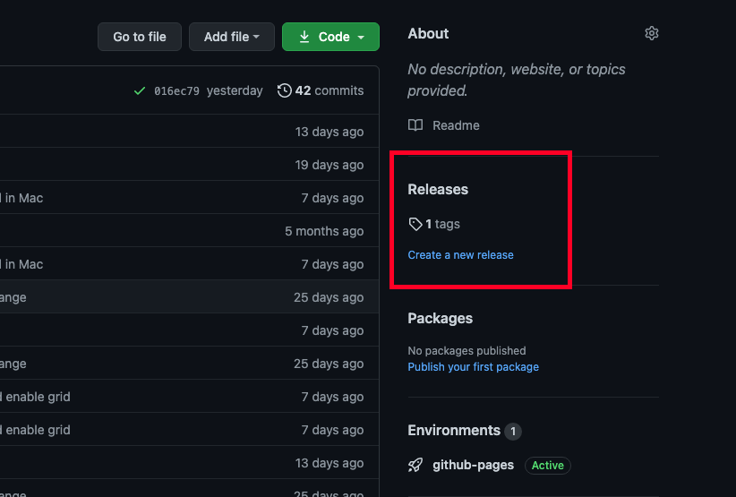

**Como Instalar?**
===============================================

Windows
-----------
Para instalar no Windows é necessário ir diretamente no repositório
https://github.com/luizborgess/controlador-digital-firmata
e realizar do download do release do programa assim como na imagem abaixo:

Inserir outra imagem aqui;

Após realizado o download deve-se simplesmente executa-lo, assim já estará pronto para o uso.

MacOs
---------
Para proceder com a instalação no MacOs, é necessário abrir o terminal, utilizar o comando:

.. code-block:: bash

    cd <pasta na qual deseja instalar>

    curl -JLO https://github.com/luizborgess/controlador-digital-firmata/archive/main.zip

    unzip controlador-digital-firmata-main.zip

    cd controlador-digital-firmata-main

    chmod 755 install_mac.sh

    ./install_mac.sh

Esse script acima realiza do download do software e instala `Homebrew`_ e o Python3.x e todas as
dependências necessárias para utilizar-lo.

.. _Homebrew: https://brew.sh/

Apos instalado o software irá iniciar automaticamente.

Para iniciar utilize o comando:

.. code-block:: bash

    cd <pasta-do-programa>
    python3 main.py

Linux
---------
Para executar o *software* no Linux, assume-se que o próprio Linux esteja atualizado com a versão de Python3 mais recente,
possuindo isso, basta utilizar os comandos abaixo para baixar o software e instalar as dependências:

.. code-block:: bash

    wget https://github.com/luizborgess/controlador-digital-firmata/archive/main.zip

    unzip main.zip

    cd controlador-digital-firmata-main

    python3 -m pip install -r requirements.txt

    sudo apt-get install --reinstall libxcb-xinerama0

    python3 main.py

Para abrir o *software* insira os  seguintes comandos no terminal:

.. code-block:: bash

    cd <pasta-do-programa>

    ./main.py
